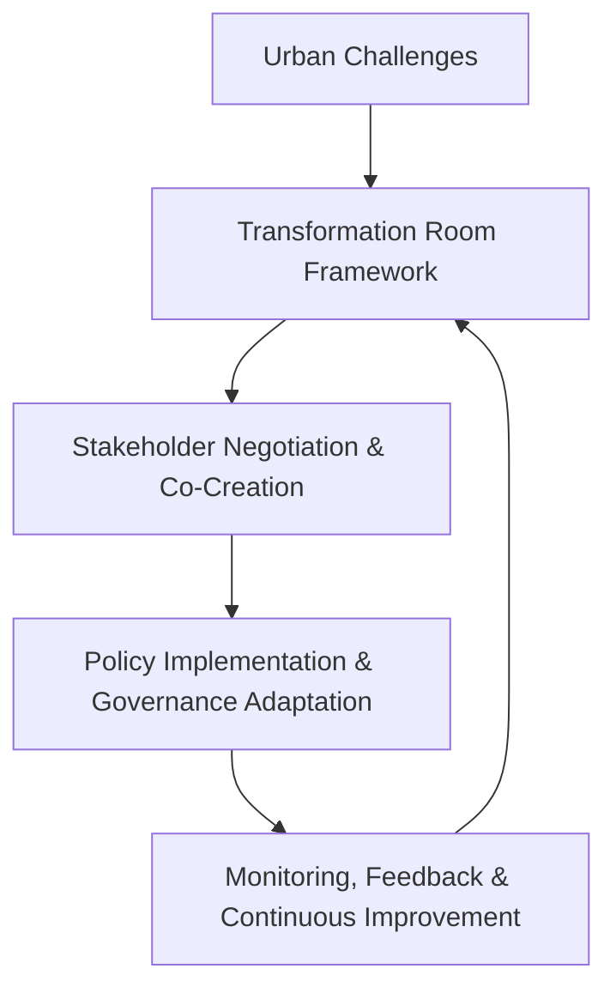

# Transformation Rooms: Building Transformative Capacity for European Cities

## Summary and Analysis

### 1. Background/Motivation

#### Context
European cities face **complex socio-technical challenges**, including rapid urbanization, environmental constraints, and governance fragmentation. Traditional urban governance models struggle to **balance innovation with existing regulatory frameworks**. The concept of *Transformation Rooms (TRs)* is proposed as a **multi-level governance intervention** to foster urban resilience and sustainable policy implementation.

#### Research Gap
Most urban governance studies focus either on **top-down planning** (government policies) or **bottom-up innovation** (grassroots participation). However, there is a lack of frameworks that **synchronize both approaches**. This paper addresses this gap by introducing **Transformation Rooms as a hybrid governance model**.

#### Importance of the Research Question
The significance of this study lies in its ability to:
- Develop **structured negotiation environments** for urban transformation.
- Improve **multi-level governance coordination**.
- Enhance the **scalability of local innovations** across European cities.

---

### 2. Methods Used

#### Theoretical Framework
The study integrates:
- **Multi-Level Perspective (MLP)**: Examines interactions between niche innovations, urban regimes, and socio-political landscapes.
- **Socio-Technical Systems Theory**: Analyzes systemic interactions between infrastructure, stakeholders, and governance models.
- **System Dynamics & Feedback Loops**: Models adaptive governance mechanisms over time.

#### Implementation Strategies
- **Structural Elements:** Defining governance roles, policy-making processes, and institutional collaboration.
- **Process Elements:** Co-creation mechanisms, feedback loops, and pilot projects for policy adaptation.

#### Mathematical/Statistical Models
The effectiveness of Transformation Rooms can be analyzed using:
- **Network Analysis:** Measures stakeholder interactions within governance models.
- **Regression Models:** Evaluates the impact of participatory governance on urban policy outcomes.
- **Differential Equations for Feedback Loops:**

\[
\frac{dP}{dt} = \alpha P (1 - P)
\]

where \( P \) represents citizen participation over time, and \( \alpha \) is a growth rate parameter determining engagement expansion.

---

### 3. Significance of the Work

#### Key Findings
- *Transformative Leadership Framework*: Identifies key leadership attributes that drive urban resilience.
- *Co-Creation and Experimentation Mechanisms*: Provides structured environments for stakeholder collaboration.
- *Governance Innovations*: Proposes hybrid governance models integrating **top-down policy-making** with **bottom-up citizen participation**.

#### Broader Impact
- Supports **evidence-based urban policy development**.
- Aligns urban strategies with **long-term ecological and economic goals**.
- Demonstrates **scalability** for cities with different governance structures.

#### Future Research Implications
- Investigating the **quantitative impact of TRs** through computational simulations.
- Applying **game-theoretic models** to optimize stakeholder negotiations.
- Integrating **machine learning models** to predict governance efficiency based on past policy implementations.

---

### 4. Connection to Other Work

#### Related Studies
- Historical perspectives on **collaborative urban governance**.
- Comparative analysis of **smart city governance frameworks**.

#### Advancements Over Previous Work
- Introduces **dynamic policy adaptation mechanisms**.
- Emphasizes **structured negotiation environments** rather than spontaneous grassroots initiatives.
- Uses **quantitative models** to support policy efficiency analysis.

---

### 5. Relevance to Capstone Project

#### Potential Integration
- **Policy Simulation Models:** Implementing *system dynamics* to test governance scenarios.
- **Urban Data Analysis:** Utilizing *machine learning* to assess **citizen engagement effectiveness**.
- **Governance Performance Metrics:** Applying *statistical evaluations* to determine the success of participatory decision-making.

#### Expansion Possibilities
- Extending TRs to **climate adaptation planning**.
- Incorporating **digital governance technologies (blockchain, AI-based decision systems)** for transparent policymaking.
- Testing the *scalability* of TRs in **non-European urban settings**.

---

## Conceptual Diagram: Feedback Loop in Governance

### Diagram Explanation:
- Urban challenges initiate the **Transformation Room** process.
- **Stakeholders collaborate** to negotiate and co-create solutions.
- Policies are **implemented and adapted** based on **real-world feedback**.
- Continuous **monitoring ensures iterative policy improvement**.

---

## References

Gudrun Rita Haindlmaier, Petra Wagner, Doris Wilhelmer. *Transformation Rooms: Building Transformative Capacity for European Cities*. International Journal of Urban Planning and Smart Cities, Vol. 2, Issue 2, 2021.
DOI: [10.4018/IJUPSC.2021070104](https://doi.org/10.4018/IJUPSC.2021070104)

---

## Notes for GitHub Repository
- This document provides **a structured review** formatted for GitHub.
- **Equations and diagrams** have been added for quantitative analysis.
- Further statistical modeling could enhance governance impact assessment.
